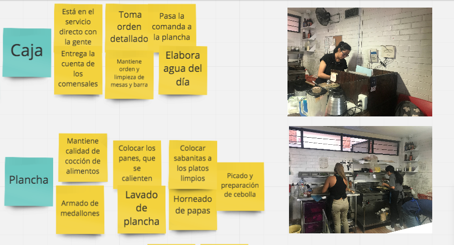
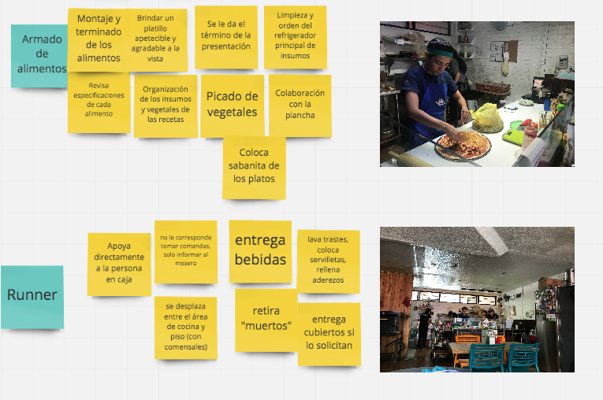
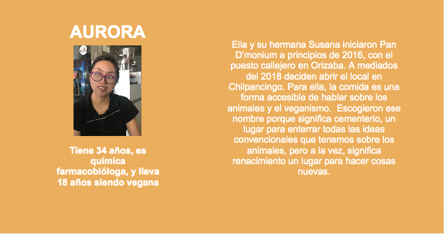
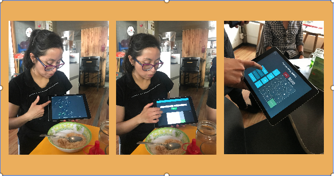
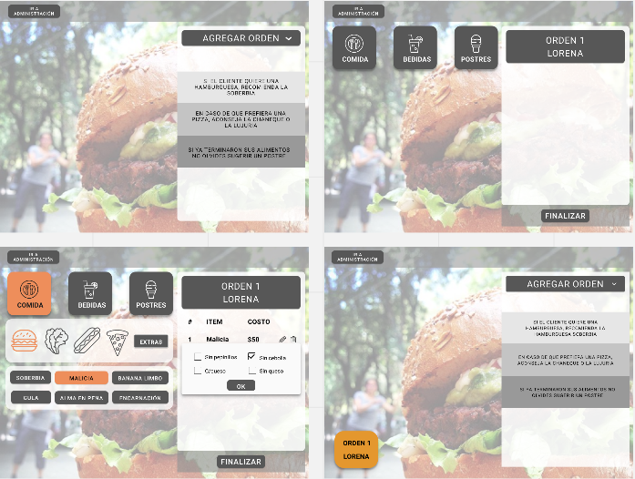

# Preámbulo

Nos contactó una cadena de comida rápida vegana (Pan D’monium, ubicado en Av. Chilpancingo 129, colonia Roma Sur) para que contruyamos una interfaz para optimizar toma de pedidos y administración dentro de su local establecido.

# Conocimiento del negocio

Para conocer cómo se realizan los pedidos y las necesidades del personal para la atención de los comensales, acudimos a las instalaciones de Pan D'monium. Fuimos atendidas por Aurora, dueña del negocio, quien nos explicó las estaciones en que se divide el negocio. Nos habló de las dificultades para utilizar el software y las repercusiones en su trabajo.

5 personas trabajan en este local establecido, todas mayormente en la cocina, por lo que cuando entran comensales, una de ellas tiene que parar lo que está haciendo para ir a atender las mesas, para regresar con el pedido y seguir preparando la comida. No hay una persona enteramente dedicada a meserear. Descubrimos que tienen promoción de pizzas al 2x1 para los días miércoles y que tienen muchas visitas ese día de la semana.

El menú de Pan D'moium ofrece 6 tipos de hamburguesas, 6 diferentes pizzas, con 3 tamaños (personal, mediana y familiar), así mismo 2 tipos de ensaladas, sodas italianas, malteadas y postres, pero no cuenta con opción en inglés.

## Entrevista con Aurora

#Entendimiento del problema

El negocio usa desde hace 6 meses la aplicación iZettle, usan además una impresora para que las comandas lleguen a cada estación en la cocina, y una terminal para realizar los cobros con tarjeta.

La aplicación le permite crear un mapa con la distribución real de las mesas del local, sin embargo, nos comenta esto le quita tiempo.

El sistema le permite ingresar todas las opciones de su menú, tanto comida como bebidas, y una característica que le agrada es poder poner especificaciones en las comandas (productos sin algún condimento o pizzas con de dos estilos diferentes).

Una vez que la orden está lista se manda a cocina y ahí se imprime la comanda, en caso de que la orden incluya productos de diferentes estaciones se imprime las veces que sean necesarias.

# Ideación

[Prototipo](https://www.figma.com/proto/qb7wqGipGcKK4CfeXtoUAj/Burger-Queen?node-id=0%3A1&scaling=scale-down)

Decidimos enfocarnos en el servicio al cliente, en el rol de la mesera y su interacción con los comensales. Para Aurora este punto es fundamental para su negocio porque este trato personalizado le creó clientes leales y frecuentes, que en este momento le comentan ya no se sienten tan acogidos y es algo que a ella le gustaría cambiar.

Por otro lado una mejora en el servicio de las meseras, supondría mayores propinas para todas, y es otro de los objetivos que se quiere alcanzar, una mayor entrada de dinero a partir de una mejora del servicio.

Para solucionar estos puntos, decidimos incluir en la primera pantalla que ve la mesera, tres recomendaciones que puede hacerle a los comensales estas se podrán modificar desde la cuenta de Administradora a la cual tendrán acceso solamente las stakeholders. 

Estas recomendaciones estarán ligadas al historial de ventas para que las stakeholders puedan reconocer que productos quizá no esté teniendo tantas ventas o sea nuevo para los comensales.

En la pantalla se tendrá a la vista, todo el tiempo, el menú y la orden que se está modificando, así como las órdenes abiertas que ya se han mandado a cocina.

# BurgerQueen

Nos contactó una cadena de comida rápida vegana para que contruyamos una interfaz para optimizar toma de pedidos y administración dentro de sus locales establecidos.

Este proyecto supone un reto mayor a los que te has enfrentado ya que abarca la fase de producción y vas a tener que trabajar de la mano con el área de Front end, así como coordinar los requerimientos de tu cliente y de tus usuarios.

**UX Design**
El restaurante Pan D'Monium tiene el objetivo de estandarizar la forma de tomar pedidos y que eso se refleje en el tiempo de entrega tanto en sucursal para posteriormente implementarlo en el resto de la cadena, así también facilitar la cobranza e impactar el trabajo en cocina.

Para lograr esto debes de entender el funcionamiento total del negocio, todo el flujo, los puntos de interacción y el rol de cada uno de los stakeholders que participan en el proceso.
El restaurante se encuentra en Av. Chilpancingo 129, Roma Sur y el nombre de tu contacto es Aurora.

Durante el proceso vas a estar en constante comunicación con tu equipo de desarrolladoras para resolver dudas técnicas acerca de tus decisiones de diseño y negociar los alcances del proyecto tanto con tu cliente como con tu equipo. Es importante que aún cuando estés desarrollando otro proyecto, no dejes de darle el seguimiento y la importancia hasta su implementación y presentación final.

### Requerimientos

- Entender cómo se realizan los pedidos en Pan D'Monium y cuáles son las necesidades del personal de cocina y del personal de atención al público (meser@s y cajer@s).
  - Ideal si dentro de la investigación toman fotos de las formas en que se toman pedidos actualmente.
- Diseñar la versión para tablets de esta aplicación, teniendo en cuenta el modo de uso de esta tablet (por ej. El uso de la     pantalla táctil) y los distintos tipos de usuarios.
  - El diseño se debe adaptar a dos tamaños de tablets 9.7 y 7 pulgadas.
  - Crear un ícono para poder agregar la pantalla al home de la tablet. Puedes usar [appicon](https://appicon.co/#app-icon) y     agregar las especificaciones para   el equipo de desarrollo.
- El estado actual del pedido siempre visible mientras tomamos un pedido.
- Necesitamos hacer una web app, así será accesible y funcionará bien en tablets iOS y Android.
- Testear e iterar los diseños con personal del restaurante.
- Entregar las especificaciones de diseño al equipo de desarrollo en Figma, Zeplin ó XD.
- Hacer seguimiento y QA a la implementación realizada por el equipo de desarrollo.
- Realizar pruebas de usabilidad de la aplicación web al final de cada entrega del equipo de desarrollo.

### Momentos Importantes

- Kick off del proyecto en el que conocerás a tu squad integrado por UX Designers y FE Developers, tendrás que coordinarte con ellas y establecer flujos de trabajo.
- Establecer contacto con el restaurante.
- Al final de la primer semana hay un check in con el cliente.
- Al final de la segunda semana hay una demo de soluciones y prototipos.
- Al final de la tercer y cuarta semana hacer check in del alcance técnico con tu squad de FE Developers.
- Al final de la cuarta semana será lde Demo Final de la totalidad del proyecto.

